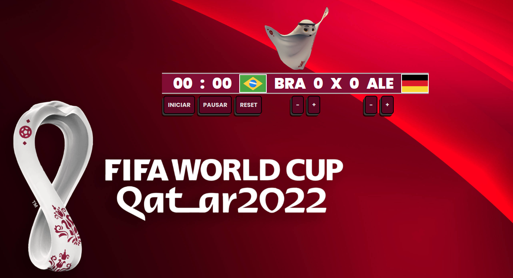

<h1 align="center"> CONTADOR DE TEMPO E GOLS DA COPA DO MUNDO 2022 </h1>

<h3 align="center">
  <a href="https://contador-copa2022.vercel.app">Acesse Meu App</a>
</h3>

  

## 🚀 Tecnologias

Esse projeto foi desenvolvido com as seguintes tecnologias:

- HTML e CSS
- JavaScript
- Git e GitHub

## 💻 Projeto

Criar o contador que aparece na tela dos jogos da copa, contando os minutos, e aumentando ou diminuindo os gols de cada time.
